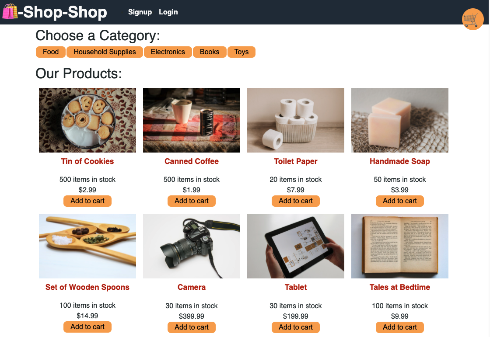

# Redux Shop-Shop
An e-commerce platform that uses Redux to manage global state.

## table of contents 
- [Purpose](#purpose)
- [Technologies-Used](#Technologies-Used)
- [Getting-started](#Getting-started)
- [Deployed-app](#deployed-app)
- [Contact](#Contact)

## Purpose 
This e-commerce platform was refactored to use Redux to manage global state instead of using Context API so that the website's state management is taken out of the React exosystem. The app uses a Redux provider so the React front end can access the store. The app passes reducers to a Redux store to determine changes to its global state and uses Redux to extract state data from the store. 

## Technologies-Used
- Redux state managment 
- React Front-end
- MongoDB database
- node.js
- express.js
- Apollo-Server

## Getting-started
To run the application clone the code and from the root of the project directory run `npm i` to install the necessary packages. Run `npm run seed` to seed the database and then run `npm run develop` to launch the application. This way you are able to run both the client and server side on a single terminal and view the fully functioning app in the browser.

- to install react-redux on an existing React app run `npm install react-redux` through your terminal
- Here are some guides on getting started with React Redux https://react-redux.js.org/introduction/getting-started 

## Deployed-app
The app was deployed on [Heroku](https://www.heroku.com) using MongoDB Atlas. To view the deployed app in action click on the following link
https://salty-plateau-17709.herokuapp.com/ 

- sample of app 

## Contact
If you have any questions feel free to contact me through my [Github](https://github.com/Araceli4690).